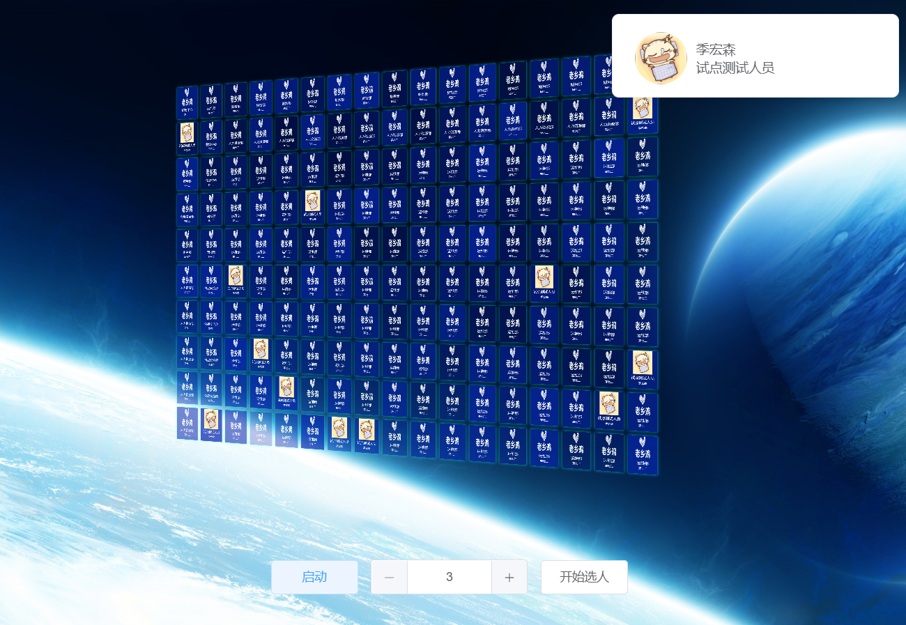
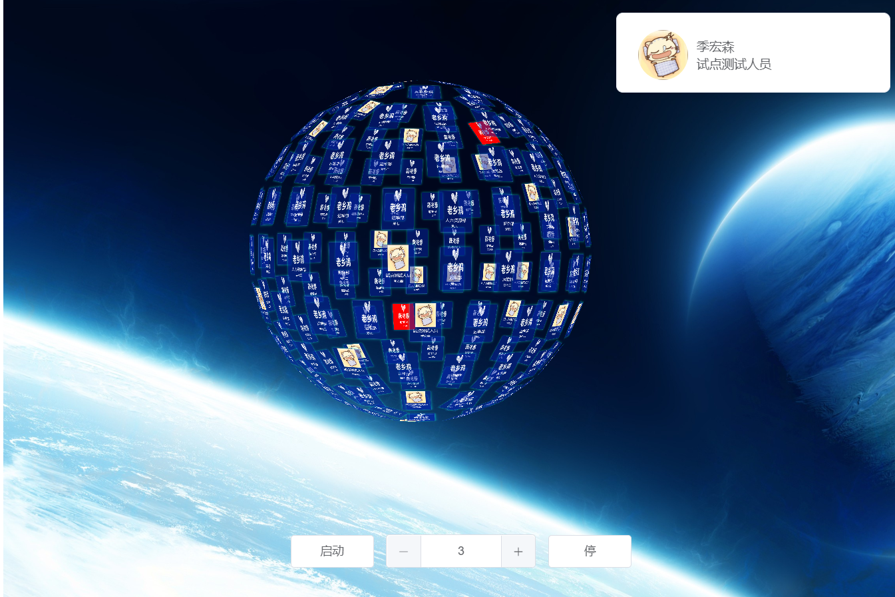
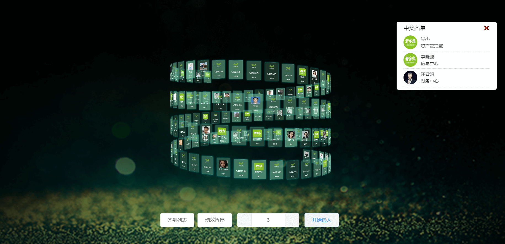

# 基于钉钉扫脸的签到抽奖项目
vue+three+websocket，结合钉钉扫脸实时签到，抽奖项目

[在线demo](http://lxjdev.lxjchina.com.cn/sign/#/)

具体场景可根据业务需求自行变更，支持实时签到、语音播报、背景音乐、签到统计、活动抽奖

项目运行
```
git clone https://github.com/BZ-koko/three_sign.git

npm i

npm run dev
```


### 签到


### 抽奖



### 统计

